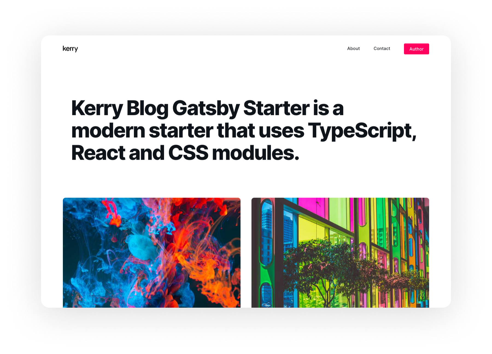

# Kerry Blog Gatsby Starter

Use Kerry Blog Gatsby Starter to start your next great Gatsby project.This starter is a customized starter of [kerry-gatsby-starter](https://github.com/kerry-tokoy/kerry-gatsby-starter).

## Quick start

1.  **Start developing.**

    Navigate into your new site’s directory and start it up.

    ```shell
    cd kerry-blog-gatsby-starter
    npm install
    gatsby develop
    ```

1.  **Open the source code and start editing!**
    µ
    Your site is now running at `http://localhost:8000`!

## What's inside?

    .
    ├── node_modules
    ├── src
    ├── .gitignore
    ├── .prettierrc
    ├── gatsby-browser.js
    ├── gatsby-config.js
    ├── gatsby-node.js
    ├── gatsby-ssr.js
    ├── package-lock.json
    ├── package.json
    └── README.md

- **`/node_modules`**: This directory contains all of the modules of code that your project depends on (npm packages) are automatically installed.

- **`/src`**: This directory will contain all of the code related to what you will see on the front-end of your site (what you see in the browser) such as your site header or a page template. `src` is a convention for “source code”.

- **`.gitignore`**: This file tells git which files it should not track / not maintain a version history for.

- **`gatsby-browser.js`**: This file is where Gatsby expects to find any usage of the [Gatsby browser APIs](https://www.gatsbyjs.org/docs/browser-apis/) (if any). These allow customization/extension of default Gatsby settings affecting the browser.

- **`gatsby-config.js`**: This is the main configuration file for a Gatsby site. This is where you can specify information about your site (metadata) like the site title and description, which Gatsby plugins you’d like to include, etc. (Check out the [config docs](https://www.gatsbyjs.org/docs/gatsby-config/) for more detail).

- **`gatsby-node.js`**: This file is where Gatsby expects to find any usage of the [Gatsby Node APIs](https://www.gatsbyjs.org/docs/node-apis/) (if any). These allow customization/extension of default Gatsby settings affecting pieces of the site build process.

- **`gatsby-ssr.js`**: This file is where Gatsby expects to find any usage of the [Gatsby server-side rendering APIs](https://www.gatsbyjs.org/docs/ssr-apis/) (if any). These allow customization of default Gatsby settings affecting server-side rendering.

- **`package-lock.json`** (See `package.json` below, first). This is an automatically generated file based on the exact versions of your npm dependencies that were installed for your project. **(You won’t change this file directly).**

- **`package.json`**: A manifest file for Node.js projects, which includes things like metadata (the project’s name, author, etc). This manifest is how npm knows which packages to install for your project.

- **`README.md`**: A text file containing useful reference information about your project.
