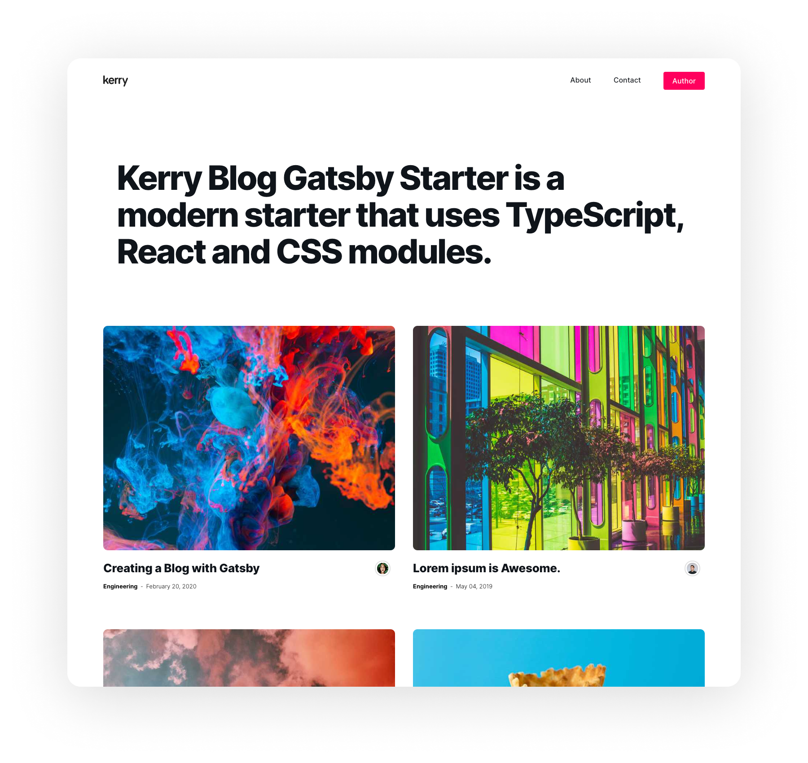

# Kerry Blog Gatsby Starter

Use Kerry Blog Gatsby Starter to start your next great Gatsby project.This starter is a customized starter of [kerry-gatsby-starter](https://github.com/kerry-tokyo/kerry-gatsby-starter).

## Quick start

1.  **Start developing.**

    Navigate into your new site’s directory and start it up.

    ```shell
    cd kerry-blog-gatsby-starter
    npm install
    gatsby develop
    ```

1.  **Open the source code and start editing!**
    µ
    Your site is now running at `http://localhost:8000`!

## Features under development

- Sort by category
- Author's page
- Related page
